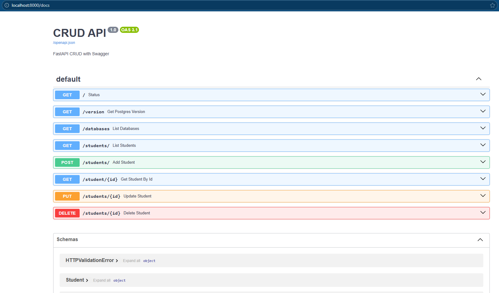

# FastAPI with PostgreSQL on Docker


A starter template for building and running a **FastAPI** application with a **PostgreSQL** database inside Docker.  
This project demonstrates a clean architecture with separate modules for models, schemas, CRUD operations, and database configuration.

---

## 🚀 Features
- FastAPI backend with automatic interactive API docs (`/docs` and `/redoc`)
- PostgreSQL database running in a Docker container
- SQLAlchemy ORM models and Pydantic schemas
- Modular project layout (`core/`, `models/`, `schemas/`, `crud.py`, `main.py`)
- Docker Compose for easy orchestration

---

## 📂 Project Structure

```text
FastApi_With_Postgress_on_Docker/
│
├── core/            # Database configuration
│   └── database.py
│
├── models/          # SQLAlchemy models
│   └── models.py
│
├── schemas/         # Pydantic schemas
│   └── schemas.py
│
├── crud.py             # CRUD operations
├── main.py             # FastAPI entrypoint
├── Dockerfile          # FastAPI container
├── docker-compose.yml  # Postgress container
└── requirements.txt    # Packages needed for fastapi

⚙️ Setup & Run

1. Clone the repo
  git clone https://github.com/Prane23/FastApi_With_Postgress_on_Docker.git
  cd FastApi_With_Postgress_on_Docker

2. Start services with Docker Compose
  docker compose up --build
  This will spin up:
  fastapi_app → FastAPI backend
  db → PostgreSQL database

3. Access the app
API root: http://localhost:8000
Swagger docs: http://localhost:8000/docs
ReDoc docs: http://localhost:8000/redoc

🧩 Example Endpoints
Add student → POST /students/
List students → GET /students/

## [Swagger docs](https://github.com/Prane23/FastApi_With_Postgress_on_Docker/blob/main/assets/fastapi_postgress_docker.png)



📖 Notes
Default database connection is configured in core/database.py.
Update docker-compose.yml with your own Postgres credentials if needed.
---

